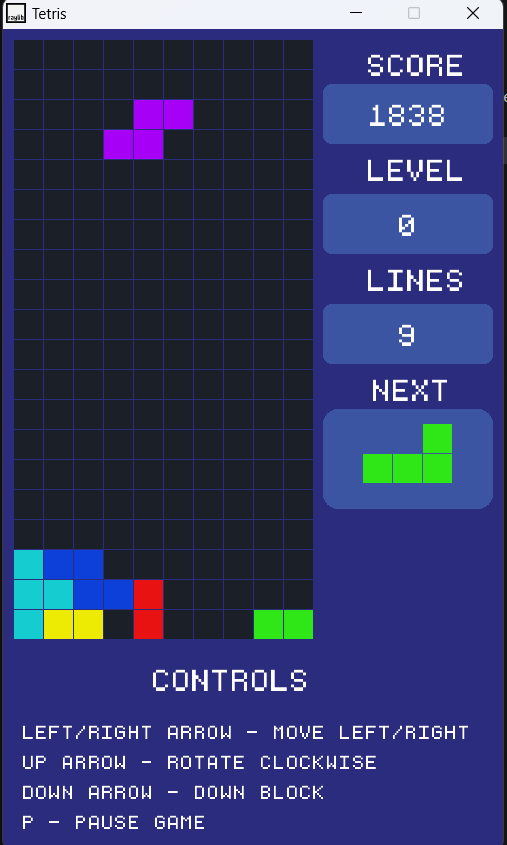

# Tetris Game in C++ with raylib

## Description
This is a simple implementation of the classic Tetris game, written in C++ and using the raylib library for graphics and input handling. The game features traditional Tetris mechanics, colorful visuals, and a smooth gaming experience. 

This project was created as a learning exercise to explore game development and improve skills in C++ and raylib.

## Features
- Classic Tetris mechanics
- Rotating and moving blocks
- Score tracking
- Colorful, minimalist graphics
- Keyboard controls for gameplay

## Requirements
- C++17 or later
- raylib 4.5 or higher
- A C++ compiler (e.g., GCC, Clang, or MSVC)
- Windows, macOS, or Linux

## Screenshots

# How to use 
 Press F5 on the keyboard to compile and run the program.
